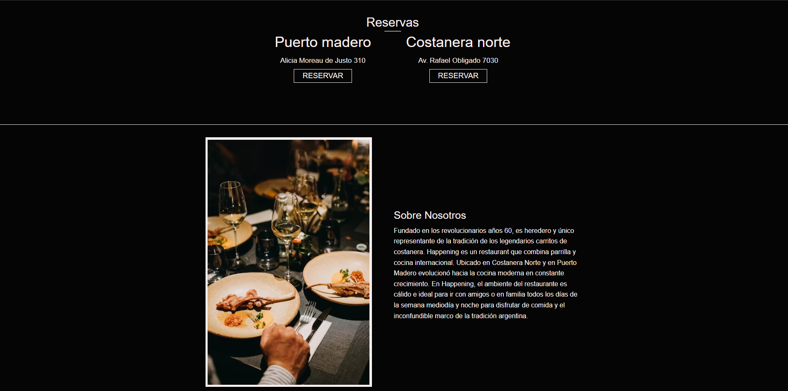

# Happening Restaurante argentino clone

En este proyecto he decidido hacer un clone de la parrila Happening.Esta contara con un sistema de reservar y cancelacion de la misma en caso de que se desee.

La tecnologias que utilize para llevar este proyecto a cabo son:

- [Laravel](https://laravel.com/)
- [PHP](https://www.php.net/)
- [Xampp](https://www.apachefriends.org/es/index.html)
- [MySQL](https://www.mysql.com/)

Para poder utilizar esta app es importante tener descargado Xampp y MySQl el cual sera nuestra base de datos.

## Tabla de contenidos

- [Comenzar](#comenzar)

## comenzar

Para comenzar lo primero que deberian de hacer es clonar este repositorio

[EOF]
